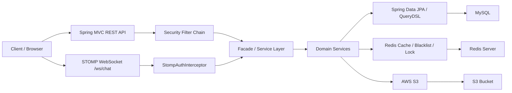
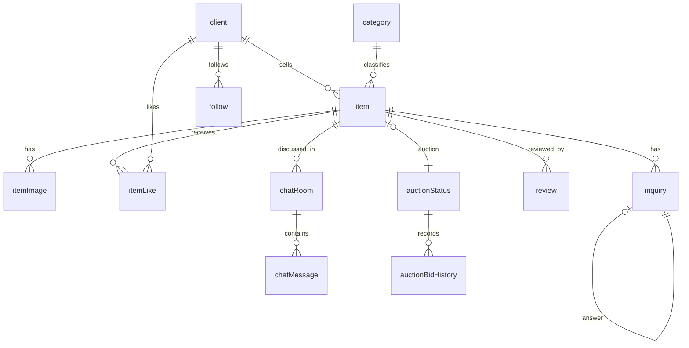

# Cabbage Market 10

Cabbage Market 10은 중고 거래, 경매 입찰, 상품 검색, 채팅, 문의, 리뷰를 제공하는 Spring Boot 기반 마켓 서비스입니다. 단순 CRUD를 넘어 인증, 캐시, 분산 락, 파일 저장소, 실시간 메시징처럼 실제 서비스에서 자주 만나는 운영 관심사를 함께 다룹니다.

저장소: https://github.com/pcb2002/Cabbage-Market-10

## 주요 기능

| 영역 | 기능 |
|---|---|
| 인증 | 회원가입, 로그인, Access Token JWT 인증, Refresh Token Cookie 재발급, 로그아웃 블랙리스트 |
| 회원 | 내 정보 조회·수정, 공개 프로필 조회, 판매글·관심목록 조회 |
| 상품 | 상품 등록, 임시저장, 게시, 수정, 상태 변경, 삭제, 목록·상세 조회 |
| 이미지 | AWS S3 상품 이미지 업로드, 대표 이미지 지정, 이미지 삭제, 실패 시 보상 삭제 |
| 검색 | QueryDSL 기반 동적 검색, Redis 기반 검색 결과 캐시, Redis Sorted Set 인기 검색어 |
| 좋아요·팔로우 | 상품 좋아요 토글, 회원 팔로우·언팔로우 |
| 문의·리뷰 | 상품 문의와 판매자 답변, 거래 완료 기반 리뷰 작성·조회 |
| 경매 | 현재가 입찰, 입찰 이력 저장, Redisson 분산 락 기반 동시성 제어 |
| 채팅 | STOMP WebSocket 연결, 채팅방 메시지 송수신, 메시지 조회 |

## 기술 스택

| 구분 | 기술 |
|---|---|
| Language | Java 17 |
| Framework | Spring Boot 4.1.0 |
| Web | Spring Web MVC, Spring WebSocket, STOMP |
| Persistence | Spring Data JPA, Hibernate, QueryDSL, MySQL, H2(test) |
| Cache / Lock | Spring Cache, Redis, Redisson, Caffeine(local/test cache) |
| Security | Spring Security, JWT(JJWT), BCrypt, CSRF Cookie |
| Storage | AWS SDK S3 |
| Test | JUnit 5, Spring Boot Test, MockMvc, embedded Redis |
| Build | Gradle |

## 아키텍처



계층은 Controller, Facade/Service, Repository 중심으로 나뉩니다. Controller는 HTTP 요청·응답과 인증 사용자 전달에 집중하고, Facade는 여러 도메인 흐름을 조합하며, Service는 도메인 규칙을 처리합니다.

## 핵심 설계 결정

- 인증은 Access Token Stateless JWT와 Refresh Token HttpOnly Cookie를 함께 사용합니다.
- 로그아웃된 Access Token의 `jti`와 정지 계정 마커는 Redis에 TTL과 함께 저장합니다.
- 상품 검색 v2는 Redis remote cache를 사용하고, 상품 변경·좋아요·입찰 성공 이후 트랜잭션 커밋 뒤 캐시를 무효화합니다.
- 인기 검색어는 Redis Sorted Set으로 일별 집계하고, 짧은 시간 반복 검색은 dedup key로 중복 집계를 줄입니다.
- 경매 입찰은 상품 단위 Redisson 분산 락으로 직렬화해 다중 인스턴스 환경에서도 현재가 갱신 순서를 보호합니다.
- 상품 이미지는 S3에 저장하며, 업로드 중 DB 저장이 실패하면 이미 업로드한 S3 객체를 보상 삭제합니다.

자세한 결정 배경은 [docs/adr/README.md](docs/adr/README.md)를 참고하세요.

## 도메인 모델

주요 엔티티는 `Client`, `Category`, `Item`, `ItemImage`, `ItemLike`, `InquiryLog`, `Follow`, `ChatRoom`, `ChatMessage`, `Review`, `AuctionStatus`, `AuctionBidHistory`입니다.



전체 컬럼, 관계, 삭제 정책은 [docs/ERD.md](docs/ERD.md)에 정리되어 있습니다.

## 프로젝트 구조

```text
src/main/java/com/example/cabbagemarket10
├── application/facade        # 여러 도메인 흐름을 조합하는 유스케이스 계층
├── domain
│   ├── auth                  # 인증, 토큰, 쿠키, 블랙리스트
│   ├── auction               # 경매 상태, 입찰 이력, 분산 락 입찰 Facade
│   ├── category              # 카테고리
│   ├── chat                  # 채팅방, 메시지, WebSocket 메시지
│   ├── client                # 회원 프로필, 내 정보
│   ├── follow                # 팔로우
│   ├── inquiry               # 상품 문의와 답변
│   ├── item                  # 상품 게시글, 좋아요, 목록·상세
│   ├── itemImage             # 상품 이미지
│   ├── itemLike              # 좋아요 엔티티
│   ├── review                # 리뷰
│   └── search                # 상품 검색, 인기 검색어
└── global
    ├── common                # 공통 설정, 응답, BaseEntity
    ├── config/cache          # 검색 캐시 설정과 무효화
    ├── exception             # 공통 예외 처리
    ├── security              # Security, JWT, CSRF
    └── util                  # S3 업로드 유틸
```

## 로컬 실행

### 1. 준비물

- JDK 17
- Docker 또는 Docker Desktop
- Gradle Wrapper(`gradlew`, `gradlew.bat`)

### 2. 환경 변수 파일 생성

```bash
cp env/local.env.example env/local.env
```

`env/local.env`에 로컬 실행 값을 채웁니다. S3 설정은 `application-local.yml`에서 필요하므로 상품 이미지 기능까지 실행하려면 아래 값도 추가합니다.

```properties
AWS_ACCESS_KEY=your-access-key
AWS_SECRET_KEY=your-secret-key
AWS_REGION=ap-northeast-2
AWS_S3_BUCKET=your-bucket
```

로컬에서 실제 S3를 쓰지 않을 경우에도 애플리케이션 컨텍스트 생성을 위해 placeholder 값을 넣어야 합니다.

### 3. MySQL과 Redis 실행

```bash
docker compose -f compose.local.yaml up -d
```

기본 포트는 MySQL `3306`, Redis `6379`입니다. 포트와 계정은 `env/local.env`에서 바꿀 수 있습니다.

### 4. 애플리케이션 실행

Windows:

```powershell
.\gradlew.bat bootRun --args='--spring.profiles.active=local'
```

macOS/Linux:

```bash
./gradlew bootRun --args='--spring.profiles.active=local'
```

정상 실행 후 기본 정적 페이지는 `http://localhost:8080/`에서 확인할 수 있습니다.

## 테스트

전체 테스트:

```powershell
.\gradlew.bat test
```

테스트 기본 프로필은 `test`입니다. 일반 테스트는 H2와 local cache를 사용하고, Redis 동작 검증이 필요한 통합 테스트는 embedded Redis로 격리합니다.

Redis cache 또는 인기 검색어 통합 테스트처럼 별도 프로필이 필요한 경우:

```powershell
.\gradlew.bat test -Dspring.profiles.active=redis-test
```

## API와 인증

REST API prefix는 `/api`, WebSocket 연결 path는 `/ws/chat`입니다. REST 응답은 공통적으로 아래 형태를 사용합니다.

```json
{
  "status": 200,
  "data": {}
}
```

오류 응답:

```json
{
  "status": 400,
  "code": "VALIDATION_ERROR",
  "message": "요청값 검증에 실패했습니다.",
  "data": null
}
```

인증 API 흐름:

1. `POST /api/auth/login`
2. 응답 헤더 `Authorization: Bearer {accessToken}` 확인
3. Refresh Token은 `refresh_token` HttpOnly Cookie로 저장
4. 인증 필요 API 요청 시 `Authorization` 헤더 전달
5. 토큰 재발급은 `POST /api/auth/refresh`
6. 로그아웃은 `POST /api/auth/logout`

상세 API 목록, 요청 검증, 오류 코드는 [docs/api.md](docs/api.md)를 참고하세요.

## 설정 요약

| 설정 | 기본값 | 설명 |
|---|---|---|
| `SPRING_PROFILES_ACTIVE` | `local` | 로컬 실행 프로필 |
| `LOCAL_DB_URL` | `jdbc:mysql://127.0.0.1:3306/cabbage_market...` | MySQL 연결 URL |
| `LOCAL_REDIS_HOST` | `127.0.0.1` | Redis host |
| `LOCAL_REDIS_PORT` | `6379` | Redis port |
| `JWT_SECRET` | 직접 설정 | JWT 서명 비밀키 |
| `JWT_ACCESS_TOKEN_EXPIRE_SECONDS` | `3600` | Access Token 만료 시간 |
| `JWT_REFRESH_TOKEN_EXPIRE_SECONDS` | `1209600` | Refresh Token 만료 시간 |
| `ALLOWED_ORIGINS` | `http://localhost:5173` | CORS 허용 origin |
| `AUCTION_REDIS_LOCK_ENABLED` | `true` | 경매 입찰 Redisson 락 활성화 |
| `AWS_S3_BUCKET` | 직접 설정 | 상품 이미지 S3 bucket |

## 문서

| 문서 | 내용 |
|---|---|
| [docs/workflow.md](docs/workflow.md) | 이슈, 브랜치, 커밋, PR, 리뷰 흐름 |
| [docs/convention.md](docs/convention.md) | 기술 스택, 계층, 구현 규칙, 테스트, 네이밍 |
| [docs/api.md](docs/api.md) | REST API와 WebSocket 계약 |
| [docs/ERD.md](docs/ERD.md) | Entity, 컬럼, 관계, 삭제 정책 |
| [docs/security.md](docs/security.md) | 인증, 권한, 민감정보, WebSocket 보안 |
| [docs/business-rules.md](docs/business-rules.md) | 도메인 규칙과 상태 기준 |
| [docs/adr/README.md](docs/adr/README.md) | 확정된 기술 결정 기록 |

## 작업 규칙

- 코드, 설정, 문서, Git 작업 전 [AGENTS.md](AGENTS.md)를 확인합니다.
- 기능 구현 흐름은 [docs/workflow.md](docs/workflow.md)를 따릅니다.
- API 계약 변경 시 [docs/api.md](docs/api.md)를 함께 갱신합니다.
- DB 스키마, 관계, 영속 enum 변경 시 [docs/ERD.md](docs/ERD.md)를 함께 갱신합니다.
- 인증, 권한, 민감정보 정책 변경 시 [docs/security.md](docs/security.md)를 함께 갱신합니다.
