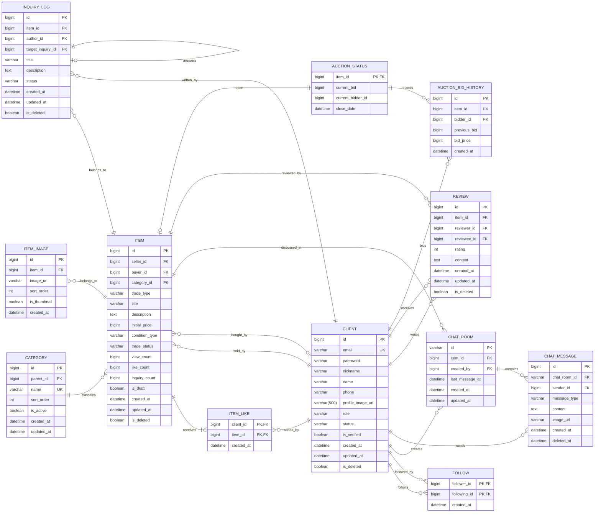

# ERD

## Mermaid

## Entity 목록

| Domain          | Entity                                   |
|-----------------|------------------------------------------|
| auth/membership | Client                                   |
| categories      | Category                                 |
| Items           | Item, ItemImage, ItemLike, AuctionStatus, AuctionBidHistory |
| Inquiries       | InquiryLog                               |
| Follow          | Follow                                   |
| chat            | ChatRoom, ChatMember, ChatMessage        |
| reviews         | Review                                   |

## Main Constraints

- `client.email` is unique.
- `category.name`is unique.
- `category.parent_id` refers `category.id`.
- `item.seller_id` refers `client.id`.
- `item.category_id` refers `category.id`.
- The Primary key of `item_like` is `(client_id, item_id)`.
- `inquiry_log.target_inquiry_id` refers `inquiry_log.id`, can be null, and is unique so each inquiry can have at most one answer.
- The `title` request field of the inquiry API is stored in `inquiry_log.title`.
- The `contents` request field of the inquiry API is stored in `inquiry_log.description`.
- The Primary Key of `follow` is `(follower_id, following_id)`.
- `follow.follower_id` and `follow.following_id` must be different.
- The Primary Key of `chat_member` is `(chat_room_id, client_id)`.
- `auction_status.item_id` is both the PK and FK to `item.id`.
- `auction_status.current_bidder_id` stores the current highest bidder's `client.id` and can be nullable before any bids are placed.
- `auction_bid_history.item_id` stores the auction item id for each successful bid.
- `auction_bid_history.bidder_id` stores the bidder's `client.id`.

## Deletion policies

| Entity        | Policies                   |
|---------------|----------------------------|
| Client        | Soft Delete, `is_deleted`  |
| Item          | Draft: Hard Delete / Published: Soft Delete, `is_deleted` |
| InquiryLog    | Soft Delete, `is_deleted`  |
| ChatMessage   | Soft Delete, `deleted_at`  |
| Review        | Soft Delete, `is_deleted`  |
| ItemImage     | Hard Delete                |
| ItemLike      | Hard Delete                |
| Follow        | Hard Delete                |
| ChatMember    | record `left_at`           |
| Category      | `is_active` = false        |
| AuctionStatus | Manage with Item lifecycle |
| AuctionBidHistory | Keep bid audit records |
